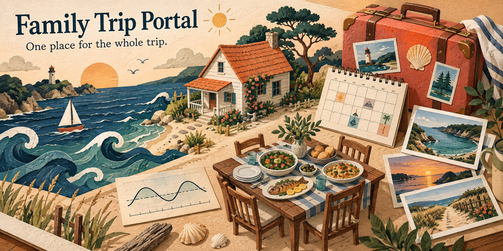

# Family Trip Portal



A home for the trip before, during and long after it happens. Put the house details, daily plan, dinner teams, packing list, local guide and memories in one readable place.

I built this for myself and my personal use. This is the full reusable project, with an entirely invented example crew and trip in place of my family's information. Make it your own, and feel free to improve mine. Hopefully it gives you a useful starting point, or at the very least some ideas. Cheers!

> **Start here:** [Try the fictional demo](https://jessemaddox.com/projects/family-trip-portal/demo/) in your browser. No account, AI subscription or installation needed. The code is MIT licensed; the included fonts keep their open font licenses.

## Just want to look around?

Open the [demo](https://jessemaddox.com/projects/family-trip-portal/demo/). Switch between the two example years. Open a meal plan, explore the tide chart, play the little sample video, or expand an older memory.

Everything in the demo is invented: people, places, dates, gatherings, food plans and tide values. The scenery is generated artwork. There are no real family photos, account IDs or provider downloads.

## Put a copy on your computer

You do not need to know Git or use a coding app.

1. Install the **LTS** version of [Node.js](https://nodejs.org/) using its normal installer. This project needs Node 22 or newer. Node is the small program that runs the local website.
2. Open [the latest release](https://github.com/jessecmaddox3/family-trip-portal/releases/latest). Download **family-trip-portal-demo-1.0.0.zip** to explore, or **family-trip-portal-source-1.0.0.zip** to customize it. Avoid the automatically generated “Source code” links if you want the packaged instructions.
3. Unzip the download. On Windows, right-click it and choose **Extract All**. Open the extracted folder.
4. On a Mac, open **Start.command**. On Windows, open **Start Windows.cmd**. A small terminal window opens, then your browser opens the portal. Keep that terminal window open while you use it.
5. To stop, click the terminal window and press **Control+C**. Your browser tab can then close.

The demo download includes a ready-built site and works offline after Node is installed. The source download needs internet for its first package setup, then builds your copy locally. Neither starts a cloud service or sends your trip files anywhere. If your browser does not open, enter **http://127.0.0.1:5050/** in its address bar.

If macOS will not open the launcher, open **Terminal**, type `cd ` (including the space), drag the extracted folder into that window and press Return. Then run `node scripts/start.mjs` for the source download, or `node serve.mjs --dir site --open` for the demo.

Linux users: open a terminal in the extracted folder and run `node scripts/start.mjs` for source, or `node serve.mjs --dir site --open` for the demo.

## Make it yours

The portal is a **read-only website generated from editable files**. Guests can browse; meal teams and packing assignments are changed by the organizer in those files. It does not include guest accounts, live RSVP forms or a shared editing backend.

Start with `portal.config.json`: change the name and description. Then edit the eight files inside `content/trips/2034/`, or copy that folder for a different year and update its dates. Open a JSON file in a plain text editor such as Visual Studio Code. Keep the quotation marks, commas and brackets; the launcher checks the files and explains configuration errors before building.

The [customization guide](docs/CUSTOMIZE.md) walks through every file, optional media, dates and a new year. There is also an [AI helper skill](skills/adapt-family-trip-portal/SKILL.md) you can give to your preferred coding assistant. AI is optional.

**Publishing makes the included content public.** This project has no login gate. Keep personal trips local, or arrange access-controlled hosting before adding private contact details or family media. Removing a navigation link or adding `noindex` does not make a page private.

## What is included?

The original design is retained: ocean-blue navigation, warm sand backgrounds, sea-glass and coral cards, wave decoration, responsive layouts and the two original font families.

| Page         | What it does                                                                                                    |
| ------------ | --------------------------------------------------------------------------------------------------------------- |
| Home         | Check-in countdown, planning counts, quick links and house preview                                              |
| Trip details | Arrival/departure, beds, capacity, amenities, rules and optional contact/map links                              |
| Schedule     | Daily events, meal/travel/free-time types and a special-gathering callout                                       |
| Tides        | Day strip, height chart, sun markers, high/low times, accessible values table and configurable planning windows |
| Meals        | Cooking pairs, menus, headcounts, dietary notes and earlier meal inspiration                                    |
| Packing      | Categorized items, quantities and organizer-recorded assignments                                                |
| Local guide  | Places, hours, practical tips and optional phone/map links                                                      |
| People       | Groups, attendance status, arrival/departure, notes and optional contacts                                       |
| Photos       | Local images, videos, captions, credits and album links                                                         |
| History      | Expandable trip timeline, traditions, playlists, video archive and optional remembrance cards                   |

## Tide planning, clearly labeled

The included wave is a fictional interface example, not a prediction for a real beach. Optional acquisition tools can download NOAA predictions and solar data **only when you explicitly run them with your own configuration**. Setup and build never fetch tides.

Activity windows express an organizer's preferences. They do not establish safe water, suitable weather or slack current. Each series says whether it is fictional, directly predicted, derived from a reference station or unavailable. Failed downloads do not silently substitute invented values. See [tide configuration and source notes](docs/TIDES.md).

## For developers

```sh
npm ci --ignore-scripts
npm test
npm run typecheck
npm run lint
npm run build
npm start
```

For an editing server: `npm run dev -- --hostname 127.0.0.1`. For a static build under a path, set `NEXT_PUBLIC_BASE_PATH=/your-path` before building. [Architecture](docs/DESIGN.md) explains the data flow and deployment boundaries.

Browser verification: `npx playwright install chromium`, then `npm run test:browser` after a build. Tests use fictional data, block external browser requests and check all routes, phone layouts, local video, history, timezone invariance and navigation. Provider tests inject fake responses.

## Improve it

Ideas and fixes are welcome. See [CONTRIBUTING.md](CONTRIBUTING.md), especially beginner setup, accessibility, additional content examples and provider edge cases. Please use invented examples in public issues.

[MIT license](LICENSE) applies to original code and content. [Asset notices](ASSETS.md) and [third-party notices](THIRD_PARTY.md) identify the bundled fonts and dependencies. This is a personal tool shared as a starting point, with no promise of ongoing support.
